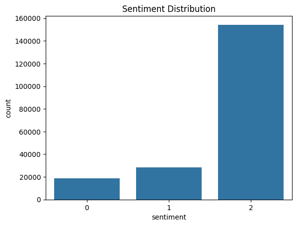
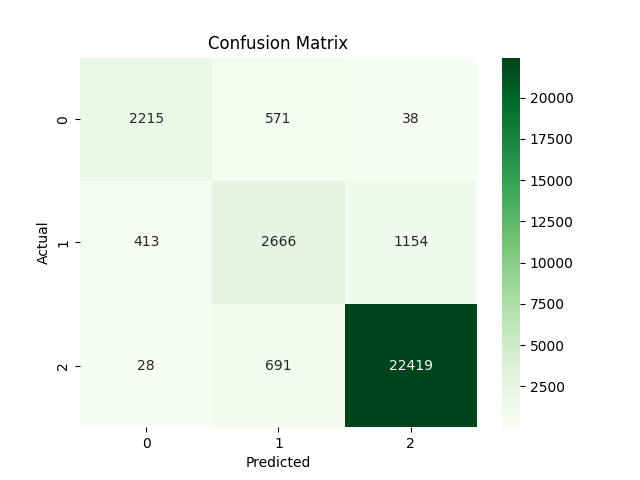

# Sentiment Analysis of TripAdvisor Hotel Reviews

## Overview

This project explores sentiment classification of TripAdvisor hotel reviews using three different natural language processing approaches: **Logistic Regression, BiLSTM, and DistilBERT**.

The goal was to classify hotel reviews as **negative, neutral, or positive** and compare the performance of a traditional machine learning model, a deep learning model, and a pre-trained transformer model.

## Dataset

The project uses a TripAdvisor hotel review dataset containing **201,295 reviews and ratings**. The original ratings were converted into three sentiment classes:

- **Negative:** Ratings 1–2
- **Neutral:** Rating 3
- **Positive:** Ratings 4–5

The dataset presented a significant class imbalance, with positive reviews representing the majority of observations.

<p align="center">
  
</p>

## Methodology

Three models were implemented and compared:

### 1. Logistic Regression

Logistic Regression was used as the baseline model. Review text was transformed into numerical features using **TF-IDF**, and class weighting was used to account for the class imbalance.

Multiple regularization strengths were evaluated, with the best model selected based on validation Macro F1 score.

### 2. BiLSTM

A **Bidirectional Long Short-Term Memory (BiLSTM)** network was implemented to capture contextual information from the reviews in both directions.

Reviews were converted into sequences and represented using **pre-trained 300-dimensional GloVe embeddings**. The network consisted of an embedding layer, bidirectional LSTM layer, dropout, and a final linear classification layer.

### 3. DistilBERT

The final approach fine-tuned the pre-trained **DistilBERT (`distilbert-base-uncased`)** transformer model for three-class sentiment classification.

Reviews were tokenized using the DistilBERT tokenizer, and the model was fine-tuned using the training data. The best model was selected based on validation Macro F1 score.

## Model Comparison

The models were evaluated using **accuracy and Macro F1 score**, with Macro F1 serving as an important metric because of the class imbalance.

| Model | Accuracy | Macro F1 |
| --- | ---: | ---: |
| Logistic Regression | 83.87% | 0.74 |
| BiLSTM | 88.77% | 0.78 |
| **DistilBERT** | **90.41%** | **0.81** |

**DistilBERT achieved the strongest overall performance**, reaching an accuracy of **90.41%** and a Macro F1 score of **0.81**.

## Best Model: DistilBERT

DistilBERT achieved the highest F1 score across all three sentiment classes:

| Sentiment | Precision | Recall | F1 Score |
| --- | ---: | ---: | ---: |
| Negative | 0.83 | 0.78 | 0.81 |
| Neutral | 0.68 | 0.63 | 0.65 |
| Positive | 0.95 | 0.97 | 0.96 |

<p align="center">
  
</p>

Although DistilBERT improved classification of the minority classes, **neutral sentiment remained the most difficult class to identify**, with reviews frequently being misclassified as either positive or negative.

## Results & Conclusion

The results showed a consistent improvement in performance as the models progressed from traditional machine learning to deep learning and transformer-based approaches. Logistic Regression achieved an accuracy of **83.87%** and a Macro F1 score of **0.74**, while BiLSTM improved these results to **88.77%** accuracy and a **0.78** Macro F1 score. DistilBERT achieved the best overall performance, with **90.41% accuracy** and a **0.81 Macro F1 score**.

Across all three models, positive reviews were classified most accurately, while neutral reviews presented the greatest challenge. DistilBERT showed the strongest performance on the neutral class, achieving an F1 score of **0.65**, compared with **0.60** for BiLSTM and **0.56** for Logistic Regression.

Overall, the results demonstrate that using a pre-trained transformer can improve sentiment classification performance, particularly when distinguishing more difficult sentiment classes. However, DistilBERT was also substantially more computationally expensive to train. BiLSTM therefore provided a strong alternative, achieving performance relatively close to DistilBERT while requiring considerably less training time.


## Repository Structure

```text
.
├── README.md
├── report.pdf
├── requirements.txt
│
├── code/
│   ├── 01_data_exploration.ipynb
│   ├── 02_logistic_regression.ipynb
│   ├── 03_bilstm.ipynb
│   └── 04_distilbert.ipynb
│
└── figures/
    ├── sentiment_distribution.png
    ├── rating_distribution.png
    ├── logistic_regression_confusion_matrix.png
    ├── bilstm_confusion_matrix.png
    └── distilbert_confusion_matrix.png
```

## Full Report

For a detailed discussion of the dataset, model architectures, training process, evaluation, and results, see the [full project report](report.pdf).
